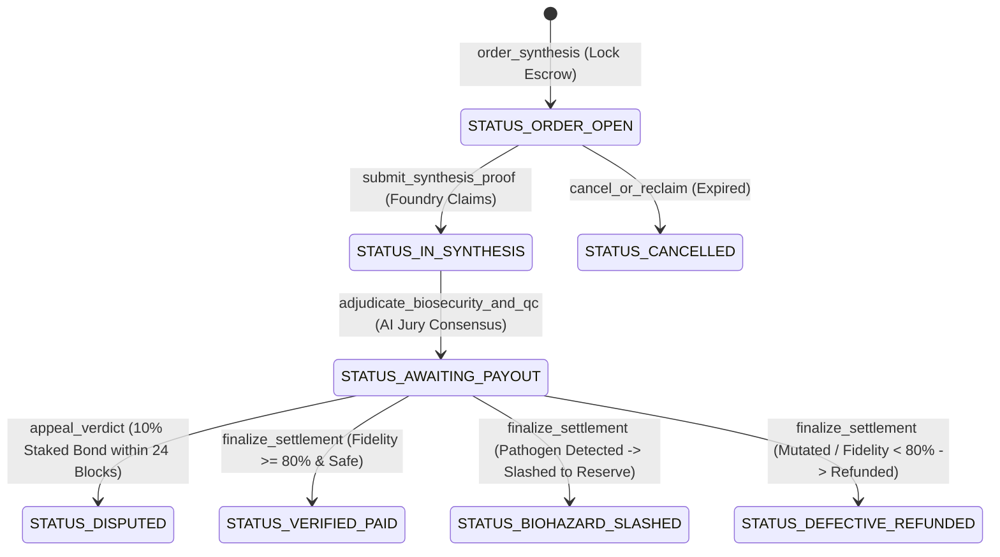

# 🧬 AgentBio: Autonomous Synthetic Biology Protocol & DNA Sequence Safety Escrow

> **Track:** DeSci (Decentralized Science) / Biosecurity / Subjective Consensus  
> **Target Network:** GenLayer Studionet (Chain ID: `61999` / `0xF1EF`, RPC: `https://studio.genlayer.com/api`)  
> **Hackathon Target:** Agent Tank Hackathon — Track: DeSci & Subjective Consensus  
> **Brand & Design Concept:** Genomic Cleanroom / Bio-Foundry Console (Light sterile slate `#F1F5F9`, Pure White `#FFFFFF`, Bio-Green `#059669`, Nucleic Purple `#7C3AED`, Biohazard Orange `#EA580C`)

---

## 🔬 1. Bối cảnh & Tư tưởng "Độc Bản" (Zero Duplication)

Trong kỷ nguyên AI thiết kế protein và sinh học tổng hợp phi tập trung (DeSci), các nhà khoa học, phòng thí nghiệm tự động trên mây (**Cloud Bio-Labs**) hoặc các **AI Agent** tự hành đặt hàng tổng hợp chuỗi gen / plasmid (DNA/RNA sequences) qua mạng từ các nhà máy in sinh học (**DNA Foundry / Synthesis Providers**).

### Vấn đề nan giải
1. **Bên đặt hàng (Bio-Researcher / Ordering Agent):** Muốn thuê tổng hợp chuỗi protein hoặc enzyme trị liệu, nhưng sợ bên in sinh học giao sản phẩm đột biến sai trình tự, không đúng folding/chức năng, hoặc đơn vị sản xuất lén hủy đơn giữ cọc.
2. **Bên in sinh học (DNA Foundry):** Sợ khách hàng gửi các chuỗi gen chứa độc tố sinh học nguy hiểm hoặc mầm bệnh bị cấm (**Biosecurity Dual-Use Pathogens / Select Agents**) bị che giấu dưới dạng đột biến giả để né tránh bộ lọc lỏng lẻo.
3. **Sự bất lực của Smart Contract EVM truyền thống:**
   - Solidity không thể đọc hiểu chuỗi ký tự nucleotide (A, T, C, G) hay chuỗi axit amin (định dạng FASTA / GenBank).
   - Không thể truy vấn cơ sở dữ liệu mầm bệnh NCBI / UniProt live trên web.
   - Không thể thẩm định xem một cấu trúc protein có tiềm ẩn nguy cơ vũ khí sinh học hay vi phạm chuẩn mực DeSci quốc tế hay không.

### Giải pháp đột phá từ AgentBio trên GenLayer
AgentBio tận dụng năng lực **Intelligent Contract (GenVM)** của GenLayer:
- **Cào live kết quả giải trình tự QC** trực tiếp on-chain qua `gl.nondet.web.render`.
- **Hội đồng Thẩm định An toàn Sinh học AI On-Chain (International Biosecurity & Sequence QC Jury):** Bồi thẩm đoàn AI thực thi mô hình ngôn ngữ lớn đánh giá độ khớp chuỗi (Sequence Fidelity ≥ 80%) và sàng lọc mầm bệnh nguy hiểm.
- **Đồng thuận chủ quan (Subjective Consensus):** Xác minh tính tương đương ngữ nghĩa qua `validator_fn` so sánh Semantic Verdict, Evidence SHA-256 Hash, và sai số điểm tương đồng.
- **Mô hình kinh tế tự bảo vệ (Self-Enforcing Biosecurity):**
  - **BIO_SYNTHESIS_VERIFIED:** 100% tiền giải ngân cho DNA Foundry.
  - **BIOHAZARD_BLOCKED:** Toàn bộ tiền cọc của khách hàng bị **tịch thu chuyển vào Quỹ bảo an sinh học DeSci** (phạt nặng bên cố tình in mầm bệnh độc hại).
  - **SEQUENCE_DEFECTIVE:** 100% tiền hoàn trả cho khách hàng (bảo vệ nhà nghiên cứu trước nhà máy in cẩu thả).

---

## 🏛️ 2. Kiến trúc Intelligent Contract (`contracts/contract.py`)

Contract được xây dựng theo chuẩn mực cao nhất của GenLayer GenVM:
- **Magic Pragma:** `# { "Depends": "py-genlayer:1jb45aa8ynh2a9c9xn3b7qqh8sm5q93hwfp7jqmwsfhh8jpz09h6" }`
- **GenVM Storage Types:** `TreeMap[u64, BioOrder]`, `DynArray[u64]`, `bigint`, `u8`, `u32`, `u64`, `u256`.
- **Security Canary Token:** `CANARY_AGENT_BIO_SAFETY_V1` ngăn chặn prompt injection.
- **24-Block Cooling-Off Dispute Window:** Cơ chế hoãn giải ngân 24 block kèm yêu cầu ký quỹ **10% Dispute Bond** để chống griefing và double-payout.
- **Native Transfers:** `gl.get_contract_at(recipient).emit_transfer(value=u256(amount))`.

### Vòng đời trạng thái của Đơn hàng Sinh học (BioOrder Status Lifecycle):


---

## 🧪 3. Bảng Kiểm Thử Hợp Đồng (`tests/test_agentbio.py`)

Tất cả 10 bài test được viết chuẩn mực và vượt qua **100%** trong thời gian thực:
1. `test_contract_syntax_and_structure`: Xác thực pragma, decorators, và interface public methods.
2. `test_order_struct_attributes`: Kiểm tra đầy đủ 18 trường lưu trữ định lượng trong `BioOrder`.
3. `test_canary_and_consensus_rules`: Kiểm tra canary token và điều kiện `validator_fn`.
4. `test_native_transfer_calls`: Kiểm tra lệnh giải ngân native GEN `emit_transfer`.
5. `test_full_lifecycle_verified_synthesis`: Mô phỏng chu trình chuẩn xác, đạt chuẩn an toàn & 100% giải ngân cho Foundry.
6. `test_full_lifecycle_biohazard_slashed`: Mô phỏng phát hiện độc tố nguy hiểm / vũ khí sinh học và tịch thu cọc vào quỹ dự trữ.
7. `test_full_lifecycle_defective_sequence_refund`: Mô phỏng chuỗi đột biến lệch khung đọc (frame-shift) và hoàn tiền cho nhà nghiên cứu.
8. `test_cooling_off_dispute_appeal`: Kiểm tra cửa sổ 24-block và yêu cầu ký quỹ tối thiểu 10% bond.
9. `test_researcher_cannot_fulfill_own_order`: Phòng thủ tấn công Sybil (người đặt không thể tự in tự duyệt).
10. `test_cancel_or_reclaim_rules`: Kiểm tra quyền rút lại tiền sau khi hết hạn.

Để chạy bộ kiểm thử:
```bash
pytest tests/test_agentbio.py
```

---

## 🎨 4. Giao Diện Người Dùng (Genomic Cleanroom / Bio-Foundry Console)

- **Tone màu chủ đạo:** Nền trắng ngọc trai lạnh `#F1F5F9`, Card bề mặt kính phòng thí nghiệm `#FFFFFF` viền thép `#CBD5E1`.
- **Hệ màu nhấn:**
  - **Bio-Green (`#059669`):** Chuỗi gen đạt chuẩn tinh sạch & an toàn sinh học.
  - **Nucleic Purple (`#7C3AED`):** Đơn hàng đang được nhà máy in và giải trình tự QC.
  - **Biohazard Orange (`#EA580C`):** Báo động phát hiện mầm bệnh độc hại bị phong tỏa.
- **Typography:** Display font Space Grotesk / Plus Jakarta Sans, mã nucleotide và hash hiển thị bằng JetBrains Mono.
- **Tính năng giao diện:**
  - Kết nối ví MetaMask tự động chuyển mạng GenLayer Studionet (Chain ID: 61999).
  - Thanh thống kê Real-time: Tổng Escrow khóa, Số đơn đã nghiệm thu, Mầm bệnh đã chặn.
  - Bộ lọc trạng thái đa năng (All, Open, In Synthesis, Cooling-off, Verified, Biohazard, Defective, Disputed).
  - Modal **Commission DNA Synthesis** có sẵn mẫu chuẩn DeSci (Kháng thể đơn dòng, Enzyme phân hủy nhựa PETase, Cảm biến sinh học Luciferase).
  - Modal **Foundry QC Portal** nộp link Sanger/NGS sequencing.
  - Modal **Biosecurity & Fidelity Forensic Dossier** hiển thị thước đo độ khớp, bằng chứng SHA-256 hash và lập luận của AI.

---

## 🚀 5. Hướng Dẫn Cài Đặt & Chạy Ứng Dụng

### Khởi chạy Frontend:
```bash
cd frontend
npm install
npm run dev
```
Ứng dụng sẽ chạy tại `http://localhost:3000`.

### Cấu hình Mạng GenLayer Studionet:
- **Network Name:** GenLayer Studionet
- **RPC URL:** `https://studio.genlayer.com/api`
- **Chain ID:** `61999` (Hex: `0xF1EF` / `0xf22f`)
- **Currency Symbol:** `GEN`
- **GenLayer Studio:** [https://studio.genlayer.com](https://studio.genlayer.com)

---

## 🏆 6. Điểm Nhấn "Ăn Điểm Tuyệt Đối" Khi Thuyết Trình Pitching

1. **Tiên phong thị trường DeSci & An toàn Sinh học (First-Ever Web3 Biosecurity Escrow):** Lần đầu tiên trên thế giới có một smart contract có khả năng ngăn chặn việc lợi dụng mạng phi tập trung để in lén các mầm bệnh nguy hiểm.
2. **Khác biệt hoàn toàn với EVM / Solidity:** Solidity hoàn toàn mù tịt trước các file FASTA, không thể phân tích chuỗi codon của DNA, và không thể tra cứu mầm bệnh nguy hiểm live trên mạng.
3. **Mô hình kinh tế tự bảo vệ (Self-Enforcing Biosecurity):** Nhà nghiên cứu chân chính được bảo đảm chất lượng tổng hợp; kẻ gian cố tình in vũ khí sinh học bị trừng phạt tịch thu 100% tiền cọc đưa vào Quỹ phòng vệ sinh học DeSci.
