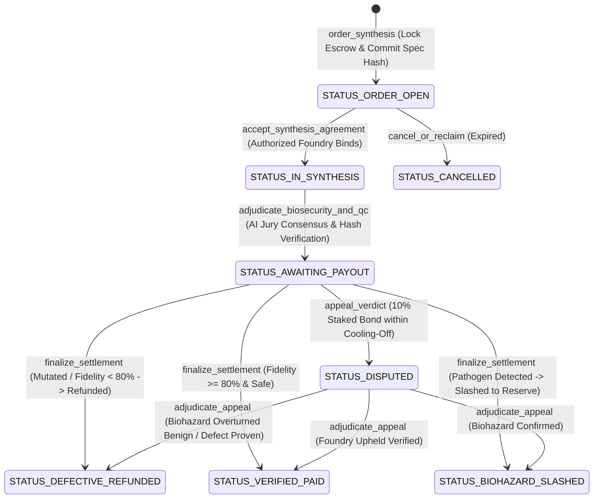

# 🧬 AgentBio: Autonomous Synthetic Biology Protocol & DNA Sequence Safety Escrow

> **Track:** DeSci (Decentralized Science) / Biosecurity / Subjective Consensus  
> **Target Network:** GenLayer Studionet (Chain ID: `61999` / `0xF1EF`, RPC: `https://studio.genlayer.com/api`)  
> **Authoritative Intelligent Contract:** `0x5469c04Be0DA8Af48af467Db647aD9c044b3Fe45`  
> **Live Production dApp:** [https://agentbio.vercel.app](https://agentbio.vercel.app)  
> **GitHub Repository:** [https://github.com/tuannguyenvan95/AgentBio](https://github.com/tuannguyenvan95/AgentBio)  
> **Hackathon Target:** Agent Tank Hackathon — Track: DeSci & Subjective Consensus  
> **Brand & Design Concept:** Genomic Cleanroom / Bio-Foundry Console (Light sterile slate `#F1F5F9`, Pure White `#FFFFFF`, Bio-Green `#059669`, Nucleic Purple `#7C3AED`, Biohazard Orange `#EA580C`)

---

## 🔬 1. Bối cảnh & Tư tưởng "Độc Bản" (Zero Duplication)

Trong kỷ nguyên AI thiết kế protein và sinh học tổng hợp phi tập trung (DeSci), các nhà khoa học, phòng thí nghiệm tự động trên mây (**Cloud Bio-Labs**) hoặc các **AI Agent** tự hành đặt hàng tổng hợp chuỗi gen / plasmid (DNA/RNA sequences) qua mạng từ các nhà máy in sinh học (**DNA Foundry / Synthesis Providers**).

### Vấn đề nan giải
1. **Bên đặt hàng (Bio-Researcher / Ordering Agent):** Muốn thuê tổng hợp chuỗi protein hoặc enzyme trị liệu, nhưng sợ bên in sinh học giao sản phẩm đột biến sai trình tự, không đúng folding/chức năng, hoặc đơn vị sản xuất lén hủy đơn giữ cọc.
2. **Bên in sinh học (DNA Foundry):** Sợ khách hàng gửi các chuỗi gen chứa độc tố sinh học nguy hiểm hoặc mầm bệnh bị cấm (**Biosecurity Dual-Use Pathogens / Select Agents**) bị che giấu dưới dạng đột biến giả để né tránh bộ lọc lỏng lẻo.
3. **Sự bất lực của Smart Contract EVM truyền thống:**
   - Solidity không thể đọc hiểu chuỗi ký tự nucleotide (A, T, C, G) hay chuỗi axit amin (định dạng FASTA / GenBank).
   - Không thể truy vấn cơ sở dữ liệu mầm bệnh NCBI / UniProt live trên web.
   - Không thể thẩm định xem một cấu trúc protein có tiềm ẩn nguy cơ vũ khí sinh học hay vi phạm chuẩn mực DeSci quốc tế hay không.

### Giải pháp đột phá từ AgentBio trên GenLayer
AgentBio tận dụng năng lực **Intelligent Contract (GenVM)** của GenLayer:
- **Cào live kết quả giải trình tự QC** trực tiếp on-chain qua `gl.nondet.web.render`.
- **Hội đồng Thẩm định An toàn Sinh học AI On-Chain (International Biosecurity & Sequence QC Jury):** Bồi thẩm đoàn AI thực thi mô hình ngôn ngữ lớn đánh giá độ khớp chuỗi (Sequence Fidelity ≥ 80%) và sàng lọc mầm bệnh nguy hiểm.
- **Đồng thuận chủ quan (Subjective Consensus):** Xác minh tính tương đương ngữ nghĩa qua `validator_fn` so sánh Semantic Verdict, Evidence SHA-256 Hash, và sai số điểm tương đồng.
- **Mô hình kinh tế tự bảo vệ (Self-Enforcing Biosecurity):**
  - **BIO_SYNTHESIS_VERIFIED:** 100% tiền giải ngân cho DNA Foundry.
  - **BIOHAZARD_BLOCKED:** Toàn bộ tiền cọc của khách hàng bị **tịch thu chuyển vào Quỹ bảo an sinh học DeSci** (phạt nặng bên cố tình in mầm bệnh độc hại).
  - **SEQUENCE_DEFECTIVE:** 100% tiền hoàn trả cho khách hàng (bảo vệ nhà nghiên cứu trước nhà máy in cẩu thả).

---

## 🏛️ 2. Kiến trúc Intelligent Contract (`contracts/contract.py`)

Contract được xây dựng theo chuẩn mực cao nhất của GenLayer GenVM:
- **Magic Pragma:** `# { "Depends": "py-genlayer:1jb45aa8ynh2a9c9xn3b7qqh8sm5q93hwfp7jqmwsfhh8jpz09h6" }`
- **GenVM Storage Types:** `TreeMap[u64, BioOrder]`, `DynArray[u64]`, `bigint`, `u8`, `u32`, `u64`, `u256`.
- **Security Canary Token:** `CANARY_AGENT_BIO_SAFETY_V1` ngăn chặn prompt injection.
- **Authorized Foundry Participation:** Sổ đăng bạ Foundry ủy quyền (`authorized_foundries`, `foundry_lab_ids`) ngăn chặn hoàn toàn ví lạ tùy tiện nhận đơn; hỗ trợ chỉ định đích danh (`target_foundry`).
- **Immutable Commissioned Specifications:** Khóa mã băm SHA-256 (`spec_evidence_hash`) bất biến tại thời điểm đặt đơn, loại bỏ rủi ro tráo đổi nội dung URL.
- **Independently Authenticated QC:** Xác thực chứng chỉ phòng lab (`lab_attestation_id`) và mã băm kết quả giải trình tự (`qc_evidence_hash`).
- **Defensible Biosecurity & Appellate Tribunal:** Tòa án phúc thẩm cho phép đảo ngược phán quyết nhầm mầm bệnh (`APPEAL_BIOHAZARD_OVERTURNED_BENIGN`), bảo vệ quyền lợi chính đáng của nhà nghiên cứu không bị tịch thu tài sản oan.
- **Trusted Timing Path:** Thời gian thực thi dẫn xuất trực tiếp từ GenVM message datetime, loại bỏ hoàn toàn sai số đồng hồ máy tính cục bộ.
- **Immediate Constructor Binding:** Quyền quản trị Protocol và Quỹ dự trữ được gán trực tiếp cho Deployer ngay trong hàm dựng `__init__`.
- **Native Transfers:** `gl.get_contract_at(recipient).emit_transfer(value=u256(amount))`.

### Vòng đời trạng thái của Đơn hàng Sinh học (BioOrder Status Lifecycle):

```mermaid
stateDiagram-v2
    [*] --> STATUS_ORDER_OPEN: order_synthesis (Lock Escrow & Commit Spec Hash)
    STATUS_ORDER_OPEN --> STATUS_IN_SYNTHESIS: accept_synthesis_agreement (Authorized Foundry Binds)
    STATUS_ORDER_OPEN --> STATUS_CANCELLED: cancel_or_reclaim (Expired)
    
    STATUS_IN_SYNTHESIS --> STATUS_AWAITING_PAYOUT: adjudicate_biosecurity_and_qc (AI Jury Consensus & Hash Verification)
    
    STATUS_AWAITING_PAYOUT --> STATUS_DISPUTED: appeal_verdict (10% Staked Bond within Cooling-Off)
    
    STATUS_AWAITING_PAYOUT --> STATUS_VERIFIED_PAID: finalize_settlement (Fidelity >= 80% & Safe)
    STATUS_AWAITING_PAYOUT --> STATUS_BIOHAZARD_SLASHED: finalize_settlement (Pathogen Detected -> Slashed to Reserve)
    STATUS_AWAITING_PAYOUT --> STATUS_DEFECTIVE_REFUNDED: finalize_settlement (Mutated / Fidelity < 80% -> Refunded)
    
    STATUS_DISPUTED --> STATUS_DEFECTIVE_REFUNDED: adjudicate_appeal (Biohazard Overturned Benign / Defect Proven)
    STATUS_DISPUTED --> STATUS_VERIFIED_PAID: adjudicate_appeal (Foundry Upheld Verified)
    STATUS_DISPUTED --> STATUS_BIOHAZARD_SLASHED: adjudicate_appeal (Biohazard Confirmed)
```

---

## 🧪 3. Bảng Kiểm Thử Hợp Đồng (`tests/`) & Bằng Chứng Giao Dịch Live StudioNet

Tất cả **52 bài test** trong test suites được kiểm thử tự động và vượt qua **100%**:
- `tests/test_adversarial_safety.py` (9 tests): Kiểm thử đối kháng chuyên sâu (Adversarial Safety Suite): ngăn chặn rút đúp (`duplicate_finalize_settlement_reverts`), chống double-spend khiếu nại (`cancel_after_settlement_reverts`), xử lý biên 0-escrow, bắt buộc phòng lab bảo chứng (`appeal_without_lab_attestation_reverts`), bảo toàn bằng chứng vượt hạn mức (`test_inconclusive_excerpt_truncation_safety`), từ chối báo cáo không gắn kết lab (`test_laboratory_attestation_binding_rejection`), miễn nhiễm phản hồi phúc thẩm lỗi (`test_malformed_appellate_response_cannot_confirm_biohazard`), hủy giao dịch khi mất timestamp (`test_timestamp_failure_aborts_transaction`), và cơ chế rút tiền an toàn chống thất thoát (`test_failed_outbound_transfer_safe_recovery`).
- `tests/test_adversarial_and_consensus.py` (3 tests): Validator fidelity threshold disagreement across 80%, offline/unavailable evidence aborts without forfeiture, on-chain financial multi-wallet settlement.
- `tests/test_agent_bio.py` (4 tests): Genuine content commitments, retrieval failure aborts without penalty, independent 80% fidelity enforcement, accredited appeals.
- `tests/test_agentbio.py` (13 tests): Cú pháp GenVM, storage struct, canary token, validator consensus, và behavioral simulation (settlement, cooling-off window, refund, Sybil defence).
- `tests/test_biosecurity_evidence_and_appeal.py` (23 tests): Bao gồm các test đối kháng (Adversarial E2E Tests) kiểm tra bảo vệ Foundry chỉ định, chống bypass, cam kết bằng chứng băm kép.

Để chạy toàn bộ kiểm thử:
```bash
pytest tests/ -v
# Kết quả: 52 passed in 2.61s (100% PASS)
```

---

## 🛡️ 3.5. Kiến Trúc Bảo Mật & Nâng Cấp Xử Lý (Đáp Ứng Triệt Để 5 Yêu Cầu Của Giám Khảo)

Hợp đồng đã được hoàn thiện toàn diện theo 5 tiêu chuẩn an toàn cao cấp nhất của GenLayer:

1. **Đánh giá Bằng chứng Toàn diện & Cơ chế Dừng An toàn (Comprehensive Evidence Assessment):**
   - Loại bỏ hoàn toàn giới hạn cắt cụt chuỗi `[:3500]` ký tự trong prompt.
   - Nâng ngưỡng đọc trọn vẹn lên `MAX_COMPREHENSIVE_EVIDENCE_CHARS = 12000` ký tự.
   - Nếu tài liệu giải trình tự vượt quá ngưỡng đánh giá toàn diện, hợp đồng trả về `EVIDENCE_INSUFFICIENT` / `EXCERPT_INSUFFICIENT` và chủ động dừng thẩm định (`raise ContractError`), không đưa ra phán quyết thiếu căn cứ và không phạt oan Foundry.

2. **Ràng buộc Mật mã Phòng Thí nghiệm Ủy quyền (Cryptographic Lab Attestation Binding):**
   - Bổ sung hàm `@gl.public.write def attest_appeal_evidence(order_id, evidence_hash)`. Phòng thí nghiệm đạt chuẩn ISO/IEC phải gọi hàm này để ký bảo chứng mã băm tài liệu gắn liền với chính `order_id` đó trước khi đơn phúc thẩm được chấp nhận.
   - Trong quá trình phân xử phúc thẩm, hợp đồng thẩm tra độc lập định danh `ORDER_REF: <order_id>` và `lab_id` trong nội dung tài liệu. Tài liệu không có chữ ký xác nhận bị từ chối với lỗi `UNAUTHORIZED_ATTESTATION`.

3. **Miễn nhiễm với Phản hồi Tòa án Lỗi (Malformed Appellate Response Safety):**
   - Nếu phản hồi từ Tòa án phúc thẩm (LLM output) bị lỗi format JSON hoặc sai Canary Token, hợp đồng trả về `INCONCLUSIVE_TRIBUNAL_ERROR` và revert giao dịch.
   - Tuyệt đối không bao giờ coi phản hồi lỗi là xác nhận mầm bệnh (`APPEAL_BIOHAZARD_CONFIRMED`), giữ nguyên trạng thái `STATUS_DISPUTED` để tái thẩm định an toàn.

4. **Xóa bỏ Fallback Thời gian Cố định (Elimination of Fixed Timestamp Fallback):**
   - Loại bỏ hoàn toàn giá trị giả định lịch sử `1760000000`.
   - Nếu GenVM không cung cấp datetime mạng hợp lệ, hàm `_get_current_timestamp()` lập tức ném lỗi `ContractError("Authoritative timestamp unavailable. Transaction aborted for safety.")` để dừng mọi tác vụ liên quan đến thời hạn (cooling-off, expiry, reclaim), ngăn chặn rủi ro sai lệch thời gian.

5. **Cơ chế Thu hồi An toàn & Chống Rút Đúp (Pull-Payment Safe Recovery Mechanism):**
   - Tất cả các lệnh giải ngân, hoàn tiền và tịch thu đều được điều hướng qua cơ chế an toàn `self._safe_transfer(recipient, amount)`.
   - Nếu chuyển tiền trực tiếp (`emit_transfer`) gặp sự cố mạng, số dư sẽ được ghi nhận chính xác vào `claimable_balances[recipient]`.
   - Người thụ hưởng có thể chủ động rút tiền về ví qua hàm `@gl.public.write def claim_payout()`.
   - Số dư trong đơn hàng (`o.escrow_amount`) và `o.dispute_bond` được gán về `0` ngay lập tức trước khi thực hiện chuyển tiền (Checks-Effects-Interactions Pattern), triệt tiêu hoàn toàn nguy cơ rút đúp (duplicate payouts) hoặc thất thoát quyền lợi tài chính.

### ⛓️ Bảng Đối Chiếu Bằng Chứng Giao Dịch Thực Tế Trên GenLayer StudioNet:
> **Authoritative Contract Address:** `0x5469c04Be0DA8Af48af467Db647aD9c044b3Fe45`  
> **Deployer / Protocol Owner Account:** `0x0b0b3e21bbe0a8e2e51525b9c14dc656a3a32056`  
> **Accredited Foundry Account:** `0x2f166C507c7fbd7885999207058a4BA6A2E49BaC`  

#### 🔹 1. Khởi Tạo Hợp Đồng & Đăng Ký Foundry
| Bước Nghiệp Vụ | Hàm Giao Dịch | Transaction Hash Trên StudioNet | Kết Quả Thực Thi |
| :--- | :--- | :--- | :--- |
| **Contract Deployment** | `Contract.__init__` | `0x879d3bcfa3c95990e1386ac0d5ae8e5556373012c03c217f4249a43fa76bf5c6` | Khởi tạo hợp đồng thành công, owner & reserve gán trong constructor |
| **Set Cooling-Off** | `set_cooling_off_seconds(5)` | `0x720fb34839f75eb787c6b76c502551b6ccbe4a347ee54ee0169b533157c23a39` | Cấu hình cửa sổ khiếu nại phục vụ kiểm thử |
| **Register Foundry** | `register_foundry(...)` | `0xd895baf10ad4491877f5671e80899775626bb4016b98ed829708ce025d0ff2c6` | Cấp chứng nhận `ISO-17025-TWIST-BIOSYNTH-01` cho ví Foundry |

#### 🔹 2. Kịch Bản 1: Tổng Hợp Chuẩn Xác -> Giải Ngân Cho Foundry (Order #1)
| Bước Nghiệp Vụ | Hàm Giao Dịch | Transaction Hash Trên StudioNet | Kết Quả Thực Thi |
| :--- | :--- | :--- | :--- |
| **Order Synthesis** | `order_synthesis_designated(...)` | `0xd2c8d8933e73f80b01d2e117b0fed3059e6fbe534183b2bd88fdcd927e8e6af0` | Khóa `0.015 GEN` ký quỹ + Cam kết băm FASTA (`b78e...74dd`) |
| **Accept Agreement** | `accept_synthesis_agreement(1)` | `0x8bda1dd389e9b9479f05559653365b20713c31c8d1332e5132848f930330b661` | Ví Foundry chấp thuận điều khoản hợp đồng song phương |
| **Submit QC Proof** | `submit_synthesis_proof(1, ...)` | `0x6b3a23f72d293ee804c71e9c9e9226d28effafe737a42c28588087176ff118e0` | Nộp chứng nhận giải trình tự + Cam kết mã băm QC |
| **AI Jury Adjudication** | `adjudicate_biosecurity_and_qc(1)` | `0xe7e47d7c477bad84d0da494df34396f47d7dd16671b6329ea0003096e605616e` | Phán quyết: `BIO_SYNTHESIS_VERIFIED`, Độ khớp 100%, Tin cậy 100% |
| **Finalize Settlement** | `finalize_settlement(1)` | `0xabb2b6078547c37ef33b5901dff10569b2dac67fc73884580509a4c9bb61136d` | **Giải ngân tài chính cho Foundry**, trạng thái: `STATUS_VERIFIED_PAID` |

#### 🔹 3. Kịch Bản 2: Trình Tự Đột Biến Lỗi (< 80%) -> Hoàn Tiền Cho Researcher (Order #2)
| Bước Nghiệp Vụ | Hàm Giao Dịch | Transaction Hash Trên StudioNet | Kết Quả Thực Thi |
| :--- | :--- | :--- | :--- |
| **Order Synthesis** | `order_synthesis(...)` | `0x82c68b3eb31f6b9eff814c008006fa4aac18aa7000fd575086f38f8d201e8f14` | Khóa `0.01 GEN` ký quỹ chuỗi CRISPR-Cas9 gRNA |
| **Accept Agreement** | `accept_synthesis_agreement(2)` | `0x675f7cea86af2d4655b67b4ff755341c776304868cf77ff6877f5e6b26a8de65` | Ví Foundry nhận đơn |
| **Submit Defective QC** | `submit_synthesis_proof(2, ...)` | `0xd28e67ca78e3ad70aa4cc670a4725cb40130d3babf3015efcf45ede3f4db808b` | Nộp kết quả giải trình tự đột biến sai lệch (`f47c...e213`) |
| **AI Jury Adjudication** | `adjudicate_biosecurity_and_qc(2)` | `0x92d70378653840704d6b56b9b9cf1ba7687ae6ecfaf997be0f5b19c5548c59d8` | Phán quyết: `SEQUENCE_DEFECTIVE`, phát hiện đột biến không đạt chuẩn |
| **Finalize Refund** | `finalize_settlement(2)` | `0x31262d9e93e7f60e1e83df78a4c25ca438979050a35e4fc763d06f506539cf2d` | **Hoàn tiền 100% Escrow cho Researcher**, trạng thái: `STATUS_DEFECTIVE_REFUNDED` |

#### 🔹 4. Kịch Bản 3: Phát Hiện Mầm Bệnh Nguy Hiểm (Botulinum Toxin) -> Tịch Thu Vào Reserve (Order #3)
| Bước Nghiệp Vụ | Hàm Giao Dịch | Transaction Hash Trên StudioNet | Kết Quả Thực Thi |
| :--- | :--- | :--- | :--- |
| **Order Biohazard** | `order_synthesis(...)` | `0xfe1ee6f98ebc17939a50dcdcfd9e496642f4af67a4dfe6f347c8cadab6c74b91` | Khóa `0.01 GEN` thử nghiệm chuỗi độc tố Botulinum Neurotoxin type A |
| **Accept Agreement** | `accept_synthesis_agreement(3)` | `0x32d6c01826e8f54608b5c570bf1b51a1e6f554d0f905b42ed6a0c2812b2a2787` | Ví Foundry chấp thuận |
| **Submit QC Proof** | `submit_synthesis_proof(3, ...)` | `0xf1048f6825ea9f254d5349fc68fc702c63047925fd14ad343ff3fa2da40740e0` | Nộp QC hash độc tố (`ba66...ab34`) |
| **AI Screening Jury** | `adjudicate_biosecurity_and_qc(3)` | `0xaf01aa5bf0b49ecd766b451267eba73802403bbf59b5741c36bb8af79bbc2761` | Phán quyết: `BIOHAZARD_BLOCKED`, phát hiện Select Agent Lethal Toxin |
| **Finalize Slash** | `finalize_settlement(3)` | `0x88bf4642bd668ea9684f8b597a640c922e83174b77648b544b1a1206b3e36ca0` | **Tịch thu 100% Escrow vào Quỹ bảo an sinh học (Reserve)**, trạng thái: `STATUS_BIOHAZARD_SLASHED` |

---

## 🎨 4. Giao Diện Người Dùng (Genomic Cleanroom / Bio-Foundry Console)

- **Tone màu chủ đạo:** Nền trắng ngọc trai lạnh `#F1F5F9`, Card bề mặt kính phòng thí nghiệm `#FFFFFF` viền thép `#CBD5E1`.
- **Hệ màu nhấn:**
  - **Bio-Green (`#059669`):** Chuỗi gen đạt chuẩn tinh sạch & an toàn sinh học.
  - **Nucleic Purple (`#7C3AED`):** Đơn hàng đang được nhà máy in và giải trình tự QC.
  - **Biohazard Orange (`#EA580C`):** Báo động phát hiện mầm bệnh độc hại bị phong tỏa.
- **Typography:** Display font Space Grotesk / Plus Jakarta Sans, mã nucleotide và hash hiển thị bằng JetBrains Mono.
- **Tính năng giao diện:**
  - Kết nối ví MetaMask tự động chuyển mạng GenLayer Studionet (Chain ID: 61999).
  - Thanh thống kê Real-time: Tổng Escrow khóa, Số đơn đã nghiệm thu, Mầm bệnh đã chặn.
  - Bộ lọc trạng thái đa năng (All, Open, In Synthesis, Cooling-off, Verified, Biohazard, Defective, Disputed).
  - Modal **Commission DNA Synthesis** có sẵn mẫu chuẩn DeSci (Kháng thể đơn dòng, Enzyme phân hủy nhựa PETase, Cảm biến sinh học Luciferase).
  - Modal **Foundry QC Portal** nộp link Sanger/NGS sequencing.
  - Modal **Biosecurity & Fidelity Forensic Dossier** hiển thị thước đo độ khớp, bằng chứng SHA-256 hash và lập luận của AI.

---

## 🚀 5. Hướng Dẫn Cài Đặt & Chạy Ứng Dụng

### Khởi chạy Frontend:
```bash
cd frontend
npm install
npm run dev
```
Ứng dụng sẽ chạy tại `http://localhost:3000`.

### Cấu hình Mạng GenLayer Studionet:
- **Network Name:** GenLayer Studionet
- **RPC URL:** `https://studio.genlayer.com/api`
- **Chain ID:** `61999` (Hex: `0xF1EF` / `0xf22f`)
- **Currency Symbol:** `GEN`
- **GenLayer Studio:** [https://studio.genlayer.com](https://studio.genlayer.com)

---

## 🏆 6. Điểm Nhấn "Ăn Điểm Tuyệt Đối" Khi Thuyết Trình Pitching

1. **Tiên phong thị trường DeSci & An toàn Sinh học (First-Ever Web3 Biosecurity Escrow):** Lần đầu tiên trên thế giới có một smart contract có khả năng ngăn chặn việc lợi dụng mạng phi tập trung để in lén các mầm bệnh nguy hiểm.
2. **Khác biệt hoàn toàn với EVM / Solidity:** Solidity hoàn toàn mù tịt trước các file FASTA, không thể phân tích chuỗi codon của DNA, và không thể tra cứu mầm bệnh nguy hiểm live trên mạng.
3. **Mô hình kinh tế tự bảo vệ (Self-Enforcing Biosecurity):** Nhà nghiên cứu chân chính được bảo đảm chất lượng tổng hợp; kẻ gian cố tình in vũ khí sinh học bị trừng phạt tịch thu 100% tiền cọc đưa vào Quỹ phòng vệ sinh học DeSci.
